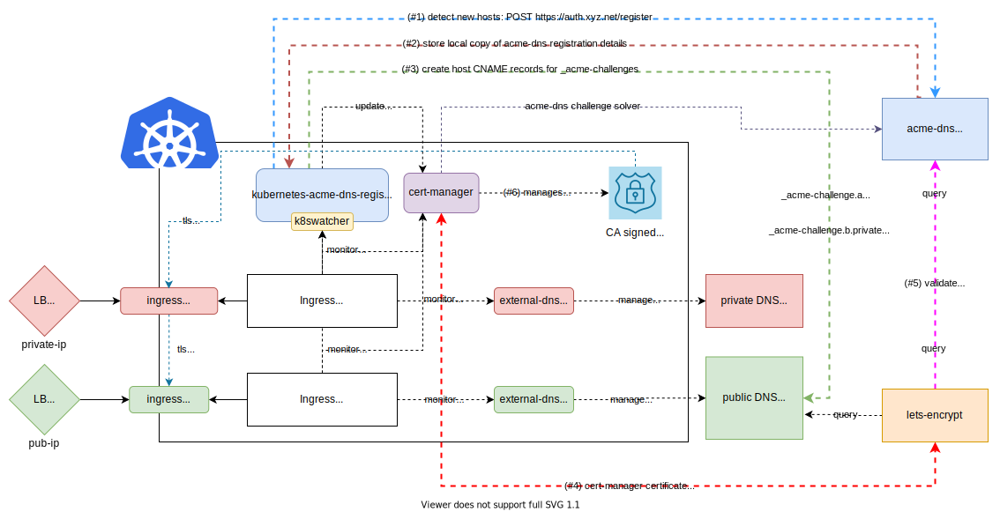

# kubernetes-acme-dns-registrar <!-- omit in TOC -->

Watches k8s resources (ingress objects etc) to trigger automatic [acme-dns registrations](https://github.com/joohoi/acme-dns), [cert-manager ACMEDNS solver secret updates](https://cert-manager.io/docs/configuration/acme/dns01/acme-dns/) and finally the required subdomain CNAME record creation across various DNS providers. (wildcards supported)

This project attempts to address the manual steps as described here in the [cert-manager dns01 acme-dns solver documentation](https://cert-manager.io/docs/configuration/acme/dns01/acme-dns/) by fully automating the following steps:

* [acme-dns registration](https://github.com/joohoi/acme-dns)
* dns provider CNAME creation
* `acme-dns.json` secret update

## table of contents <!-- omit in TOC -->
- [features](#features)
- [overview](#overview)
    - [example output](#example-output)
- [setup](#setup)
  - [overview of overall setup](#overview-of-overall-setup)
- [docker](#docker)
  - [Docker Build:](#docker-build)
  - [Docker Run manual:](#docker-run-manual)
  - [Docker Run with .env file:](#docker-run-with-env-file)
- [API](#api)
- [local dev](#local-dev)
  - [local run](#local-run)
- [troubleshooting](#troubleshooting)
  - [review the ACMEDNS cert-manager acme-dns.json secret data](#review-the-acmedns-cert-manager-acme-dnsjson-secret-data)
- [related projects](#related-projects)
- [TODO](#todo)
- [k8swatcher lib dev install](#k8swatcher-lib-dev-install)

# features

* extensible to support any kubernetes `kind` trigger (currently `Ingress` `tls.hosts[]` supported)
* automatic [acme-dns challenge server registration](https://github.com/joohoi/acme-dns) 
* automatic updates to the [cert-manager acme-dns solver secret i.e. acme-dns.json](https://cert-manager.io/docs/configuration/acme/dns01/acme-dns/) 
* automatic [dnsprovider](core/dnsprovider) CNAME creation
* works with wildcards
* works with private dns scenarios
* simple API for reviewing database of `Registrations`
# overview

This project provides some additional automation to help make your life easier when using the **awesome** [acme-dns DNS challenge server](https://github.com/joohoi/acme-dns). The diagram below shows a sample architecture where this project can be utilized to automate the typically manual [acme-dns registration](https://cert-manager.io/docs/configuration/acme/dns01/acme-dns/) steps that one must take per-domain prior to having [cert-manager](https://cert-manager.io/) do its work. 

*note, the `load-balancers`, `Ingress/Controllers`, `external-dns` and `dns server` components in this diagram are just here as an example architecture. They key function of `kubernetes-acme-dns-registrar` is listening for kubernetes events, to drive the automation of `cert-manager` based TLS certificate issuance via `acme-dns`. Currently watching `Ingress` objects is supported, but PRs are welcome to add support for watching any other kubernetes `kinds`!*



### example output

Here are some example logs showing what this does, here we are detecting one new domain name from the `tls.hosts` section of an `Ingress` object that gets deployed on kubernetes. We react by creating a new registration in `acme-dns`, saving the meta-data to our local storage, updating the `acme-dns` kubernetes secret and then use the `azuredns` provider to automatically create the `CNAME` pointer to the `acme-dns` subdomin so that that `cert-manager` can fulfill the negotiation w/ `lets-encrypt` to issue the certificate for the `Ingress'`

On startup and until stopped, we watch for `Ingress` events via [k8swatcher](https://bitsofinfo/k8swatcher)
```bash
K8sWatcher - DEBUG - K8sWatcher() loading kube config: k8s_config_file_path=/opt/scripts/kubeconfig.secret k8s_config_context_name=myk8sctx (Note: 'None' = using defaults)
K8sWatcher - DEBUG - __iter__() processing K8sWatchConfig[kind=Ingress]
K8sWatcher - DEBUG - handle_k8s_object_list() processing K8sWatchConfig[kind=Ingress]
AcmeDnsK8sSecretStore - DEBUG - AcmeDnsK8sSecretStore() managing cert-manager acmedns dns solver secret @ namespace=cert-manager name=acme-dns key=acme-dns.json
AcmeDnsK8sSecretStore - DEBUG - AcmeDnsK8sSecretStore() loading kube config: k8s_config_file_path=/opt/scripts/kubeconfig.secret k8s_config_context_name=myk8sctx (Note: 'None' = using defaults)
K8sWatcher - DEBUG - __iter__() processing K8sWatchConfig[kind=Ingress]
K8sWatcher - DEBUG - handle_k8s_object_watch() processing K8sWatchConfig[kind=Ingress]
```

We load any [dnsproviders](core/dnsprovider) we have configured (currently only `azure` is supported, PRs welcome) and k8s events come in, we react:
```
BaseAzureDnsProvider azuredns - DEBUG - AzureDnsProvider azuredns enabled
DnsProviderProcessor - DEBUG - load_dns_providers() registered DnsProvider: azuredns
DnsProviderProcessor - DEBUG - DnsProviderProcessor() starting run of process_dns_registration_events()....
RegistrarService - DEBUG - __init__() RegistrarService started OK...
```

(#1) we create a [acme-dns](https://github.com/joohoi/acme-dns) registration for the subdomain and (#2) save the registration in our local db. We only do this if we have not registered this name previously.
```
ACMEDnsRegistrar - DEBUG - run() received DomainNameEvent for LOADED *.mydomain.net
ACMEDnsRegistrar - DEBUG - run() no Registration record exists for *.mydomain.net ... creating
ACMEDnsRegistrar - DEBUG - run() POSTed registration @ http://auth.mydomain.net/register for *.mydomain.net OK
ACMEDnsRegistrar - DEBUG - run() local Registration record PUT OK in local RegistrationStore for *.mydomain.net target: f0ab4cfa-5976-49df-9e06-22c919891ad5.auth.mydomain.net
```

Next we do (#3), update the registration credentials in the [ACMEDNS solver in cert-manager](https://cert-manager.io/docs/configuration/acme/dns01/acme-dns)
```
AcmeDnsK8sSecretStore - DEBUG - put_acme_dns_registrations_k8s_secret_data() successfully PATCHed k8s secret of acme-dns registrations for cert-manager @ cert-manager:acme-dns:acme-dns.json
```

Now for (#4) we ensure the CNAME record exists in our dns provider:
```
DnsProviderProcessor - DEBUG - process_dns_registration_events() invoking ensure_cname_for_acme_dns() -> azuredns
BaseAzureDnsProvider azuredns - DEBUG - ensure_cname_for_acme_dns() azuredns processed *.mydomain.net (_acme-challenge) -> f0ab4cfa-5976-49df-9e06-22c919891ad5.auth.mydomain.net
DnsProviderProcessor - DEBUG - process_dns_registration_events() successfully completed for: azuredns
```

At this point `cert-manager`, `acme-dns` and `lets-encrypt` take over for items #5, #6, #7, and #8 above in the diagram. It might take a minute or so but it saves a lot of manual work.

# setup

## overview of overall setup

Trying to figure out an entire dynamic tls certificate solution in kubernetes can be daunting. [This guide(docs/setup.md) will try to point you in the right direction by laying out the general guideposts and order of operations. 

Please check-out [docs/setup](docs/setup.md)

# docker

The official image is at: https://hub.docker.com/repository/docker/bitsofinfo/kubernetes-acme-dns-registrar
## Docker Build:

The [Dockerfile](Dockerfile) can be built locally with the following command:

```
docker build -t kubernetes-acme-dns-registrar:<your-tag> .
```

## Docker Run manual:
```
docker run \
    -p 8000:8000 \
    -v `pwd`/kubeconfig.secret:/opt/scripts/kubeconfig.secret \
    -v `pwd`/dev.k8s-watcher-config.yaml:/opt/scripts/k8s-watcher-config.yaml \
    -v `pwd`/dev.acme-dns-config.yaml:/opt/scripts/acme-dns-config.yaml \
    -v `pwd`/dev.dns-provider-config.yaml:/opt/scripts/dns-provider-config.yaml \
    -v `pwd`/dev.dns-provider-secrets.yaml:/opt/scripts/dns-provider-secrets.yaml\
        \
    -e KADR_K8S_WATCHER_CONFIG_YAML=file@/opt/scripts/k8s-watcher-config.yaml \
    -e KADR_ACME_DNS_CONFIG_YAML=file@/opt/scripts/acme-dns-config.yaml \
    -e KADR_DNS_PROVIDER_CONFIG_YAML=file@/opt/scripts/dns-provider-config.yaml \
    -e KADR_DNS_PROVIDER_SECRETS_YAML=file@/opt/scripts/dns-provider-secrets.yaml \
    -e KADR_JWT_SECRET_KEY=123 \
    -e KADR_K8S_WATCHER_CONFIG_FILE_PATH=/opt/scripts/kubeconfig.secret \
    -e KADR_K8S_WATCHER_CONTEXT_NAME=my-k8s-context \
    -e KADR_K8S_ACMEDNS_SECRETS_STORE_CONFIG_FILE_PATH=/opt/scripts/kubeconfig.secret \
    -e KADR_K8S_ACMEDNS_SECRETS_STORE_CONTEXT_NAME=my-k8s-context \
        \
    bitsofinfo/kubernetes-acme-dns-registrar:dev-latest
```

## Docker Run with .env file:

`cp sample.env .env`

```
docker run \
    -p 8000:8000 \
        \
    -v `pwd`/.env:/opt/scripts/.env \
        \
    -v `pwd`/kubeconfig.secret:/opt/scripts/kubeconfig.secret \
    -v `pwd`/dev.k8s-watcher-config.yaml:/opt/scripts/k8s-watcher-config.yaml \
    -v `pwd`/dev.acme-dns-config.yaml:/opt/scripts/acme-dns-config.yaml \
    -v `pwd`/dev.dns-provider-config.yaml:/opt/scripts/dns-provider-config.yaml \
    -v `pwd`/dev.dns-provider-secrets.yaml:/opt/scripts/dns-provider-secrets.yaml \
        \
    bitsofinfo/kubernetes-acme-dns-registrar:dev-latest
```
# API

Once you start up the registrar, you can access the following endpoints:

http://localhost:8000/docs

* `GET /health` - FastAPI healthcheck endpoint
* `GET /docs` - FastAPI swagger docs
* `POST /oauth2/token` - Acquire an OAuth2 `client_credentials` grant token (username/pw basic auth OR via `client_id/client_secret` FORM post params)
* `GET /registrations[/{name}]` - View the registrar's `Registration` database records

# local dev

```
python3 -m venv kubernetes-acme-dns-registrar.ve
source kubernetes-acme-dns-registrar.ve/bin/activate
pip install -r requirements-dev.txt
```

## local run

```bash
KADR_K8S_WATCHER_CONFIG_YAML=file@`pwd`/dev.k8s-watcher-config.yaml \
KADR_ACME_DNS_CONFIG_YAML=file@`pwd`/dev.acme-dns-config.yaml \
KADR_DNS_PROVIDER_CONFIG_YAML=file@`pwd`/dev.dns-provider-config.yaml \
KADR_DNS_PROVIDER_SECRETS_YAML=file@`pwd`/dev.dns-provider-secrets.yaml \
KADR_JWT_SECRET_KEY=123 \
KADR_K8S_WATCHER_CONFIG_FILE_PATH=/opt/scripts/kubeconfig.secret \
KADR_K8S_WATCHER_CONTEXT_NAME=my-k8s-context \
KADR_K8S_ACMEDNS_SECRETS_STORE_CONFIG_FILE_PATH=/opt/scripts/kubeconfig.secret \
KADR_K8S_ACMEDNS_SECRETS_STORE_CONTEXT_NAME=my-k8s-context \
    \
 uvicorn main:app --reload
```
# troubleshooting
## review the ACMEDNS cert-manager acme-dns.json secret data

the `Registrar` automatically [manages the ACMEDNS `cert-manager` secret](https://cert-manager.io/docs/configuration/acme/dns01/acme-dns/) that contains all registrations. You can quickly validate its contents; i.e.:

```
kubectl get secret acme-dns -n cert-manager -o json | jq -r '.data."acme-dns.json"' | base64 --decode | jq
```
# related projects

https://github.com/joohoi/acme-dns  

https://github.com/bitsofinfo/k8swatcher

# TODO

* more robust implementation of `RegistrationStore` (i.e. sqllite etc)
* configuration of `k8s.py` `K8sKindHostExtractor's` per watcher config, currently assumed Ingress

# k8swatcher lib dev install

```
 pip install     \
    --index-url https://test.pypi.org/simple/     \
    --extra-index-url https://pypi.org/simple/     \
    k8swatcher==0.0.0.20220509142406
```